# BUPT Campus Notice Monitor

This skill guides an agent to initialize and operate the Iris/Asgard scraping script for 北京邮电大学 only. Do not generalize it into a multi-university crawler: the target sources are BUPT CAS, `my.bupt.edu.cn`, and optionally `ucloud.bupt.edu.cn`.

## When to Use

- User wants 北邮校园网 / 校内通知 / 办事指南 / 校园新闻 / 规章制度 自动抓取
- User wants AI筛选通知, important/watch/ignore classification, deadlines, summaries, action items
- User wants 北邮 UCloud 作业进入晚报
- User wants 早报、晚报、午报或自由时间轮询配置
- User says Hermes should help initialize the scraping script config

**Do NOT use for:** other schools, generic portal crawling, non-BUPT CAS systems, or rewriting Iris from scratch.

## Operating Rule

Hermes initializes **the scraping script configuration**, not Hermes itself. It should collect user choices, then edit `.env` and `config.yaml` for Iris/Asgard.

Do not ask the user to paste secrets into chat if the environment supports secure secret entry. If secrets are provided, store them only in `.env`; never commit `.env`.

## Initialization Flow

Ask these questions before editing config:

| Question | Stored in |
|----------|-----------|
| 北邮账号 / 学号 | `.env: MY_BUPT_USERNAME`, `UCLOUD_USERNAME` if homework enabled |
| 北邮密码 | `.env: MY_BUPT_PASSWORD`, `UCLOUD_PASSWORD` if homework enabled |
| 是否有手动导出的校园网 Cookie | `.env: MY_BUPT_COOKIE` fallback |
| OpenAI-compatible API key/base/model | `.env: OPENAI_API_KEY`, `OPENAI_BASE_URL`, `AI_MODEL` |
| 用户画像：学院、年级、校区、关注方向 | `config.yaml: assistant.user_profile` |
| 是否抓取 UCloud 作业 | `config.yaml: ucloud.enabled` |
| 选择投递策略：早报/晚报/午报/自由轮询 | `config.yaml: scheduler`, `runtime.polling_interval` |
| 是否发送邮件 | `config.yaml: email.*` and `.env: EMAIL_*` |

## BUPT Sources

| Source | Purpose | Config section |
|--------|---------|----------------|
| `auth.bupt.edu.cn/authserver/login` | CAS login | `auth`, `ucloud.login_url` |
| `my.bupt.edu.cn/list.jsp?...wbtreeid=1154` | 校内通知 | `portals[校内通知]` |
| `my.bupt.edu.cn/list.jsp?...wbtreeid=1524` | 办事指南 | `portals[办事指南]` |
| `my.bupt.edu.cn/list.jsp?...wbtreeid=1221` | 校园新闻 | `portals[校园新闻]` |
| `my.bupt.edu.cn/list.jsp?...wbtreeid=1536` | 规章制度 | `portals[规章制度]` |
| `ucloud.bupt.edu.cn` / `apiucloud.bupt.edu.cn` | UCloud 作业 | `ucloud` |

Do not replace these with example domains.

## Core Pipeline

```dot
digraph pipeline {
    rankdir=LR;
    "BUPT CAS / Cookie" [shape=box];
    "BUPT Portal Lists" [shape=box];
    "Title Triage\n(batch 40)" [shape=box];
    "Fetch Bodies\n(non-ignore only)" [shape=box];
    "Body Refine\n(batch 8)" [shape=box];
    "Storage\nSHA-256(url+title)" [shape=cylinder];
    "Report Mode\n晨报/晚报/heartbeat" [shape=box];

    "BUPT CAS / Cookie" -> "BUPT Portal Lists";
    "BUPT Portal Lists" -> "Title Triage\n(batch 40)";
    "Title Triage\n(batch 40)" -> "Fetch Bodies\n(non-ignore only)" [label="important/watch"];
    "Title Triage\n(batch 40)" -> "Storage\nSHA-256(url+title)" [label="ignore"];
    "Fetch Bodies\n(non-ignore only)" -> "Body Refine\n(batch 8)";
    "Body Refine\n(batch 8)" -> "Storage\nSHA-256(url+title)";
    "Storage\nSHA-256(url+title)" -> "Report Mode\n晨报/晚报/heartbeat";
}
```



## Scheduling Presets

Current Iris supports three delivery modes: `morning_digest`, `evening_digest`, and `heartbeat`. A “午报” should be represented by moving a digest time to noon or by using heartbeat at noon.

| User choice | Configure |
|-------------|-----------|
| 晚报包含作业 | `ucloud.enabled: true`; `scheduler.evening_digest_time: "20:00"` or user-chosen time |
| 早报看昨日校园新闻 | `scheduler.morning_digest_time: "08:00"`; keep `digest_only_portals: ["校园新闻"]` |
| 午报 | If digest-style: set `morning_digest_time: "12:00"`; if lightweight: use heartbeat slot around 12:00 |
| 自由时间轮询 | Set `active_start`, `active_end`, `heartbeat_interval_hours`, and `runtime.polling_interval` |
| 只抓不发邮件 | `email.enabled: false`; run `python -m src --once --preview` or `--loop` |

See [references/setup.md](references/setup.md) for exact YAML snippets.

## AI Triage Rules

Use the existing two-stage design:

1. Title batch triage (`title_batch_size`, default 40): important/watch/ignore.
2. Fetch detail page only for important/watch.
3. Body batch refinement (`body_batch_size`, default 8): summary, reason, deadline, action_items, confidence.
4. If LLM fails: primary API → backup API → keyword fallback.

Do not replace this with one API call per notice or a 1-5 score.

## Common Mistakes

| Mistake | Fix |
|---------|-----|
| Turning this into a generic university crawler | Keep it BUPT-only: `my.bupt.edu.cn`, `auth.bupt.edu.cn`, `ucloud.bupt.edu.cn` |
| Initializing Hermes instead of Iris config | Edit `.env` and `config.yaml` for the scraping script |
| Asking user to edit Python for schedule choices | Use `scheduler` and `runtime` config first |
| Adding per-school adapter classes | Not needed; this skill targets BUPT only |
| Sending full bodies to the LLM for every item | Keep two-stage title/body triage |
| Disabling keyword fallback | Keep fallback usable when API is unavailable |
| Committing account/password/API keys | Store in `.env`, never commit secrets |
| Treating “午报” as a new code mode by default | Use existing `morning_digest` at noon or heartbeat unless user explicitly asks for code changes |

## Verification

After initialization, run:

```bash
python -m src --once --preview
python -m src --email-test morning_digest   # only if email.enabled=true
python -m src --loop                        # for continuous scheduled operation
```

If CAS fails, try cookie fallback before changing code. If UCloud fails, verify `UCLOUD_USERNAME`, `UCLOUD_PASSWORD`, `UCLOUD_COOKIE`, or `UCLOUD_TOKEN` depending on the selected auth method.
